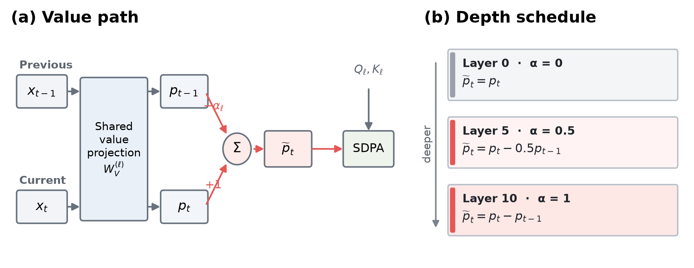
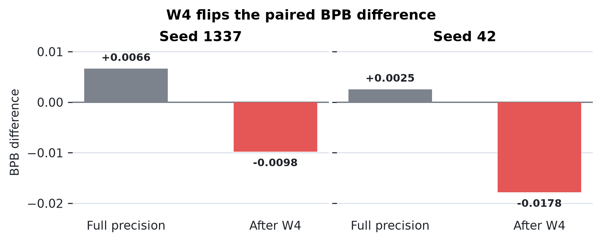
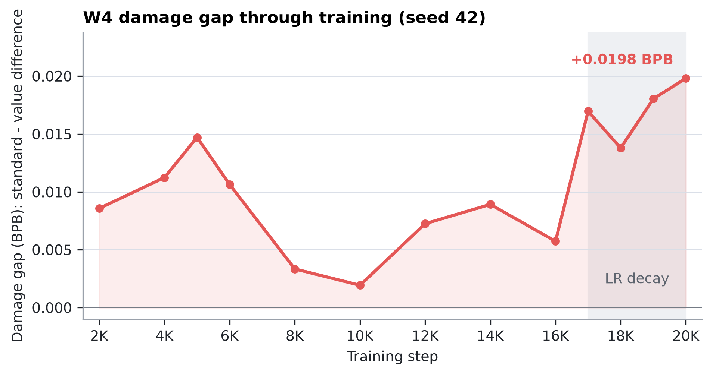
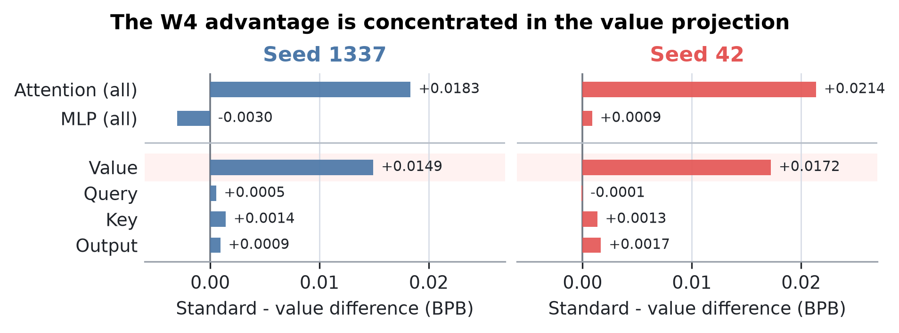
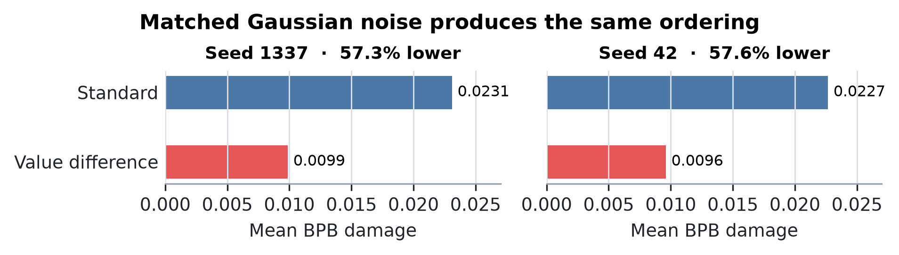

# Value Differencing Halves 4-Bit Quantization Damage in Attention

David Gao 
July 2026

## Abstract

I began with a representational question: if neighboring token values become
redundant with depth, should deep attention transmit what changed rather than
repeat the raw value? I tested a one-line modification that subtracts the
previous token's value projection with a coefficient that increases from zero
to one across layers. It did not improve full-precision language modeling. At
20,000 matched training steps, the modified 27M-parameter models finished
0.0025--0.0066 BPB behind standard attention. The unexpected result appeared
after weights-only 4-bit quantization: value differencing reduced W4 damage by
18.9% and 22.3% in two seeds, leaving the quantized models 0.0098 and 0.0178 BPB
ahead. I then traced the effect to the architecture itself. Quantizing only
attention weights cut damage by about half, and the value projection accounted
for roughly 81% of that gap in both seeds. RMSE-matched Gaussian perturbations
of attention weights produced the same ordering in all six paired controls,
showing that the result is not specific to round-to-nearest quantization. The
current implementation trains 6.7% slower and does not win at matched wall
clock, so I claim a small-scale result about lower local sensitivity of
attention parameters, not a production-efficiency result.

## 1. Introduction

Architecture studies usually stop at full precision. Deployment does not.
Weights may later be rounded to four bits, pruned, or transformed by a calibrated
quantizer, and two models that look equivalent before that step need not remain
equivalent afterward.

This paper began somewhere else. I was studying adjacent-token redundancy in
the values carried by attention. The measurements suggested a simple idea:
deeper layers might transmit local changes more effectively than repeated raw
content. I encoded that idea as *depth-scheduled value differencing*.[^name] Early
layers use ordinary values; each deeper layer subtracts more of the preceding
token's value projection; the final layer transmits the full difference.

[^name]: Earlier project artifacts use the name ``DG Attention.'' I use the
    descriptive term *value differencing* in this paper.

The full-precision result was unremarkable. Across the two final 20K runs,
value differencing was slightly worse than standard attention. The interesting
result emerged only after I rounded the large attention and MLP weight matrices
to signed 4-bit values. That operation reversed the model ordering in both
seeds: the modified checkpoints lost less quality and finished better after
quantization.

That reversal could have been a measurement artifact or a property of some
unrelated module. I therefore treated it as a question, not a conclusion. A
component-by-component evaluation localized the gap to attention weights and,
more specifically, to the value projection changed by the architecture.
Quantization error itself was nearly unchanged, yet its effect on validation
loss was roughly halved. Random attention-weight perturbations matched to the
same relative RMSE produced the same result. Together, these controls support a
precise conclusion: in this setting, training with value differencing makes the
model less sensitive to perturbations of its attention parameters.

The scope is deliberately narrow. I study two training seeds, 27M-parameter
FineWeb models, one tokenizer, one MLP family, BPB, and a calibration-free
per-row W4 baseline. I do not claim a faster model, a production quantizer, or
generalization to larger scales. The contribution is the localized empirical
result and the sequence of controls that reduced a broad architectural idea to
something the evidence actually supports.

## 2. Value Differencing

### 2.1 Architecture

Let $x_{\ell,t}$ be the hidden state at layer $\ell$ and token position $t$.
Standard attention projects it into queries, keys, and values. I leave the
query and key paths unchanged and replace only the value payload:

$$
p_{\ell,t}=W^{(\ell)}_Vx_{\ell,t}, \qquad
\widetilde p_{\ell,t}=p_{\ell,t}-\alpha_\ell p_{\ell,t-1}, \qquad
\alpha_\ell=\frac{\ell}{L-1}.
$$

Here $W_V^{(\ell)}$ is layer $\ell$'s learned value-projection matrix,
$p_{\ell,t}$ is the value vector that standard attention would transmit, and
$\alpha_\ell$ is a fixed coefficient controlling how much of the previous
token's projected value is subtracted. The tilde marks the modified payload.

The first token uses $p_{\ell,-1}=0$. With $L=11$, $\alpha_\ell$ increases
linearly from $0$ to $1$. Layer 0 is therefore standard attention; the deepest
layer transmits the full previous-token difference. Attention then computes

$$
y_\ell=W^{(\ell)}_O\,
\operatorname{SDPA}\!\left(Q_\ell,K_\ell,\widetilde P_\ell\right).
$$

Here $Q_\ell$ and $K_\ell$ are the usual query and key tensors,
$W_O^{(\ell)}$ is the learned output projection, and SDPA is causal scaled
dot-product attention.

This change preserves all tensor dimensions and adds no learned parameters to
the matched baseline. Both models use the same grouped-query attention,
RMSNorm, RoPE, Q-gain, and output projection. The implementation projects the
values once, shifts the projected tensor by one token, and subtracts the scaled
shift. It remains on the fused SDPA path and requires no custom attention
kernel.

**Figure 1.** Value differencing changes only the payload supplied to
attention. The same learned value projection processes the current and previous
positions. The fixed coefficient $\alpha_\ell$ grows with depth, moving from
raw values to full previous-token differences; queries and keys are unchanged.

### 2.2 Quantization protocol

My primary diagnostic is weights-only, per-row, round-to-nearest W4. For each
eligible weight row $w$, I compute

$$
s=\frac{\lVert w\rVert_\infty}{7}, \qquad
q=\operatorname{clip}\!\left(\operatorname{round}(w/s),-8,7\right),
\qquad \widehat w=sq.
$$

The canonical policy applies this operation symmetrically to large attention
and MLP matrices in both architectures. Activations remain high precision;
embeddings, normalization parameters, learned scales, and small control
tensors are not quantized. I define quantization damage within each checkpoint:

$$
\Delta_{\mathrm{W4}}
=\operatorname{BPB}(\widehat\theta)-\operatorname{BPB}(\theta).
$$

Lower BPB and lower damage are better. This is intentionally a transparent
diagnostic, not a substitute for GPTQ, AWQ, or a production W4A16 kernel.

### 2.3 Training and evaluation

I train matched standard and value-difference models on FineWeb with a
1,024-token vocabulary. Each model has dimension 512, 11 skip-connected
blocks, eight query heads, four key/value heads, ReLU-squared MLPs, and about
27M parameters. Runs use 49 data shards, sequence length 1,024, 393,216 tokens
per optimizer step, Muon for matrix parameters, and 20,000 steps. The learning
rate is constant through step 17K and then decays linearly for 3K steps.

All claim-bearing endpoint and localization results use raw pre-SWA
checkpoints and the same certified 256-sequence evaluator. Comparisons are
paired by training seed and checkpoint. The two independent endpoint seeds are
1337 and 42; intermediate checkpoints and perturbation seeds are not counted as
additional training seeds. Appendix D records evaluator calibration,
eligibility corrections, preregistration hashes, and artifact provenance.

## 3. Quantization Reverses the Ordering

### 3.1 Endpoints

Figure 2 contains the central result. Standard attention is better before
quantization in both seeds. After W4, value differencing is better in both. It
reduces W4 damage by 18.95% and 22.33%, overcoming the full-precision deficit
and improving post-W4 BPB by 0.00978 and 0.01782. Appendix A reports the exact
evaluator values.

**Figure 2.** Paired BPB difference between value differencing and standard
attention. Positive values mean standard attention has lower BPB; negative
values mean value differencing has lower BPB. W4 changes the sign in both
training seeds.

The comparison is matched by training tokens, not time. Peak VRAM is tied, and
the measured implementation takes 6.72% longer per step. At the nearest saved
approximately matched-wall-clock checkpoints, it wins only one of four late
comparisons (Appendix A). The result is therefore not compute-adjusted
superiority.

### 3.2 The gap persists through training

The seed-42 run saved 13 paired checkpoints from 2K to 20K steps. Value
differencing takes less W4 damage at every checkpoint under the original
conservative eligibility policy (Figure 3). These points are one trajectory,
not 13 replications, but they show that the endpoint is not a single-checkpoint
accident. The independent seed-1337 endpoint agrees in direction.

**Figure 3.** Standard minus value-difference W4 damage through the seed-42
run; positive values favor value differencing. The gap widens during the final
learning-rate decay, from 0.00573 BPB at 16K to 0.01981 at 20K. I treat this as
descriptive context, consistent with prior work on training dynamics and
quantization \citep{ouyang2024undertrained,catalan2025training}, not as a
mechanism.

## 4. The Difference Lives in Attention

### 4.1 Component isolation

Quantizing one parameter group at a time gave a sharp answer:
attention-only W4 reproduces or exceeds the entire architecture gap, whereas
MLP-only W4 is null or weakly favors standard attention.

**Figure 4.** Standard-minus-value-difference damage by parameter group;
positive values favor value differencing. The whole-module comparison is shown
separately from the projections nested inside attention. Each point is a
separate intervention, so the effects need not add linearly.

The value projection alone accounts for 81.4% and 80.7% of the matched
attention-only gap. Isolating queries, keys, or the output projection explains
less than 9% in either seed, and one query gap changes sign. The result thus
localizes first to attention and then to the exact projection modified by value
differencing. Exact paired damages and row provenance appear in Appendix B.

This is not simply lower quantization error. Attention-weight relative RMSE is
0.11854 versus 0.11759 in seed 1337 and 0.11717 versus 0.11691 in seed 42: a
0.2--0.8% difference in reconstruction error accompanies a 51.9--52.8%
difference in BPB damage. The same-sized numerical error has a different
functional consequence.

### 4.2 A perturbation control

Round-to-nearest W4 has a particular error structure. To test whether the
ordering depends on that structure, I add independent Gaussian noise to
eligible attention weights at per-tensor relative RMSE 0.117. Across three
paired noise seeds per training seed, every comparison favors value
differencing. Mean damage falls from 0.02310 to 0.00987 BPB in seed 1337 and
from 0.02266 to 0.00960 BPB in seed 42 (Figure 5).

**Figure 5.** Mean BPB damage under RMSE-matched Gaussian perturbations of
attention weights. Value differencing reduces damage by 57.3% and 57.6% across
the two training seeds. Appendix C reports all six paired noise realizations.

This control rejects an explanation specific to deterministic W4 rounding. It
supports lower local sensitivity within the tested attention-parameter
subspace. It does **not** establish that the entire model lies in a globally
flatter loss basin. Appendix C reports all six perturbation rows and the small
historical eligibility asymmetry, which biases against the modified model.

## 5. What Did Not Survive

The final claim is narrower than the project that produced it. That narrowing
is evidence, not backstory to hide.

I first expected value differencing to save memory or improve full-precision
quality. It did neither: tensor dimensions and peak VRAM are unchanged, and the
current implementation is slower. Early pruning and dead-zone results suggested
broad compression robustness, but those rankings conflicted across seeds at
20K. I then preregistered a training-maturity inversion and a cross-module
compensation hypothesis; the seed-42 trajectory and branch interventions
rejected both. Gentle int6 quantization is effectively a null for both models.

What survives those tests is specific and repeatable within the measured
setting: W4 damage is lower, the difference is attention-local, most of it lies
in the value projection, and RMSE-matched random perturbations reproduce the
ordering. Appendix E gives the complete hypothesis ledger, including the tests
that failed.

## 6. Interpretation

The experiments separate *error size* from *error consequence*. W4 changes the
two models' attention weights by nearly the same relative amount, but the
change hurts standard attention roughly twice as much. Because the random-noise
control agrees, the phenomenon is broader than one rounding rule. The strongest
statement I can make is that value differencing lowers local sensitivity to
attention-parameter perturbations in these checkpoints.

Why remains open. Value differencing may reduce the leverage of particular
channels, change activation outliers, distribute payload information across
neighboring positions, or guide optimization toward a less sensitive region of
the attention subspace. One measured correlate points toward an outlier story:
in a separate branch audit, a standard-model layer-3 MLP branch reached RMS
175.4 and maximum magnitude 134,060, versus 22.0 and 8,213 under value
differencing. That measurement is not causal and did not come from the
attention-W4 intervention, so I do not use it to explain the result.

## 7. Related Work

Architecture-side quantizability has direct precedent. Quantizable Transformers
changes attention to suppress activation outliers and enable W8A8
quantization \citep{bondarenko2023quantizable}. My result differs in both the
intervention and regime: value semantics rather than softmax/no-op behavior,
and weights-only W4 rather than full INT8. The shared lesson is that attention
architecture can change what later compression destroys.

GPTQ and AWQ use calibration data to repair weight quantization
\citep{frantar2022gptq,lin2024awq}; QuaRot and SpinQuant use rotations to reduce
outliers \citep{ashkboos2024quarot,liu2024spinquant}. They are stronger
deployment baselines than the transparent RTN diagnostic used here. Whether
they erase or compound the architecture gap is unanswered.

KV Shifting Attention establishes learned local shifts of keys and values as
prior art \citep{xu2024kvshift}. I isolate a fixed, subtractive V-side schedule
and study parameter sensitivity rather than claiming token shifting itself as
new. Differential Transformer is separate: it subtracts attention maps on the
score side, whereas I difference value payloads across token positions
\citep{ye2024differential}. Massive-activation work motivates the outlier
hypothesis but does not establish it here \citep{sun2024massive}.

Finally, recent studies show that quantization behavior changes over training
\citep{ouyang2024undertrained,catalan2025training}. My trajectory agrees with
that broad observation. The new result is the paired architecture difference
and its localization to the modified value projection.

## 8. Limitations

This is a small-scale study: 27M parameters, FineWeb/SP1024, ReLU-squared MLPs,
BPB evaluation, and two independent 20K training seeds. I report both seeds
separately and do not claim statistical significance or a population-level
effect. The quantizer is calibration-free, per-row RTN W4. I have not tested
GPTQ, AWQ, production group formats, activation quantization, downstream tasks,
or a real W4A16 kernel.

The implementation is 6.72% slower per step, ties peak VRAM, and gives no
consistent advantage for equal elapsed training time. Nothing here supports an
inference-speed claim or production adoption. A deployment study would require
larger models, modern matched-byte quantizers, downstream evaluation, and
kernel-level latency and memory measurements.

The experiments establish localization and local sensitivity, not mechanism.
The result may disappear with scale, a different MLP family, or a quantizer
that repairs the vulnerable directions in standard attention. Those are useful
boundaries for future work, not assumptions I treat as passed.

## 9. Conclusion

Value differencing did not deliver the full-precision win I originally sought.
It did something more specific: it made the attention parameters, especially
the value projection, substantially less sensitive to W4 and matched random
perturbations. In two 20K seeds, that difference was large enough to reverse the
post-W4 model ordering.

The practical question remains open because the experiment is small and the
implementation is slower. The scientific result is nevertheless clear within
its scope: changing what attention transmits can change how much damage its
weights cause when perturbed, even when their numerical reconstruction error is
almost the same.

## Data and Code Availability

I maintain the code at <https://github.com/ddavidgao/parameter-golf>. The
submission release will pin the evaluator, run scripts, source archives,
checkpoint hashes, raw logs, CSV summaries, cost ledgers, and SHA-256 manifests
to an immutable commit. Every paid run used a software cost cap, durable local
mirroring, and pod deletion after checksum verification.

## Appendix A. Runtime and Probe-Specific Results

The canonical endpoint values underlying Figure 2 are:

| Seed | Model | FP BPB | W4 damage | Post-W4 BPB |
| ---: | --- | ---: | ---: | ---: |
| 1337 | standard | 1.1539035 | 0.0866231 | 1.2405266 |
| 1337 | value difference | 1.1605306 | 0.0702112 | **1.2307418** |
| 42 | standard | 1.1571615 | 0.0911300 | 1.2482915 |
| 42 | value difference | 1.1596927 | 0.0707769 | **1.2304696** |

These are raw pre-SWA checkpoints evaluated on 256 sequences under the
symmetric W4 policy.

At nearest saved approximately matched-wall-clock checkpoints, value
differencing wins one of four late comparisons. These pairs are not
schedule-matched reruns and may occupy different learning-rate phases.

| Standard step | Value-difference step | Time difference | Standard post-W4 | Value-difference post-W4 | Winner |
| ---: | ---: | ---: | ---: | ---: | --- |
| 17K | 16K | -0.24% | 1.31044 | 1.30170 | value difference |
| 18K | 17K | +0.18% | 1.28715 | 1.29583 | standard |
| 19K | 18K | +0.60% | 1.27167 | 1.27536 | standard |
| 20K | 19K | +1.13% | 1.24775 | 1.25639 | standard |

The broad compression hypothesis also failed. At 20K, MLP pruning and int5
dead-zone rankings disagree between the two seeds:

| Seed | State / evaluator | Probe | Standard damage | Value-difference damage | Gap |
| ---: | --- | --- | ---: | ---: | ---: |
| 1337 | post-SWA, legacy | 50% MLP prune | 0.12995 | 0.16549 | -0.03554 |
| 42 | pre-SWA, 256 seq. | 50% MLP prune | 0.16704 | 0.15640 | +0.01064 |
| 1337 | post-SWA, legacy | MLP int5 dead zone | 0.03215 | 0.07859 | -0.04644 |
| 42 | pre-SWA, 256 seq. | MLP int5 dead zone | 0.04649 | 0.03939 | +0.00709 |

Positive gaps favor value differencing. Because checkpoint states and evaluator
scopes differ across the legacy seed-1337 and later seed-42 diagnostics, I
interpret only paired within-row orderings and make no pruning claim.

## Appendix B. Evaluator and Component Details

The canonical endpoint policy quantizes both architectures' eligible final-layer
K matrices. The original trajectory policy retained `blocks.10.attn.c_k` but
not the modified model's equivalently placed `c_dk`; it therefore quantized one
extra modified-model matrix. Two later symmetric controls, retaining both or
quantizing both, preserve the ordering in both seeds.

The attention+MLP and attention-only rows below come from the symmetric
quantize-both control log. The remaining rows come from the adjudicated
component session. Every damage value is paired with the FP baseline from its
own session. Cross-session FP reproduction agrees within 0.000011 BPB.

The full component split underlying Figure 4 is:

| Seed | Component | Standard damage | Value-difference damage | Gap | Share of attention gap |
| ---: | --- | ---: | ---: | ---: | ---: |
| 1337 | attention + MLP | 0.086623 | 0.070211 | +0.016412 | -- |
| 1337 | attention | 0.035336 | 0.016992 | +0.018344 | 100.0% |
| 1337 | MLP | 0.044402 | 0.047444 | -0.003042 | -- |
| 1337 | query | 0.002503 | 0.001966 | +0.000537 | 2.9% |
| 1337 | key | 0.003459 | 0.002044 | +0.001415 | 7.7% |
| 1337 | value | 0.021857 | 0.006924 | +0.014933 | 81.4% |
| 1337 | output | 0.006117 | 0.005187 | +0.000930 | 5.1% |
| 42 | attention + MLP | 0.091130 | 0.070777 | +0.020353 | -- |
| 42 | attention | 0.040447 | 0.019077 | +0.021370 | 100.0% |
| 42 | MLP | 0.046621 | 0.045742 | +0.000879 | -- |
| 42 | query | 0.002252 | 0.002357 | -0.000104 | -0.5% |
| 42 | key | 0.003153 | 0.001804 | +0.001349 | 6.3% |
| 42 | value | 0.024911 | 0.007672 | +0.017239 | 80.7% |
| 42 | output | 0.006572 | 0.004887 | +0.001685 | 7.9% |

Shares use the canonical attention-only gap. They do not sum to 100% because
each row quantizes one component in isolation and the interventions interact
nonlinearly. An unpreregistered embedding-only diagnostic also favors value
differencing in both seeds (+0.00546 and +0.00413 BPB), but embeddings are
excluded from the canonical W4 policy and the observation carries no claim.

## Appendix C. Gaussian Attention-Weight Controls

Each row uses per-tensor relative RMSE 0.117. Noise seeds are paired across
architectures.

| Training seed | Noise seed | Standard damage | Value-difference damage | Gap |
| ---: | ---: | ---: | ---: | ---: |
| 1337 | 1001 | 0.025228 | 0.010417 | +0.014811 |
| 1337 | 1002 | 0.022408 | 0.009817 | +0.012591 |
| 1337 | 1003 | 0.021659 | 0.009389 | +0.012270 |
| 42 | 1001 | 0.023731 | 0.009222 | +0.014510 |
| 42 | 1002 | 0.020759 | 0.009590 | +0.011169 |
| 42 | 1003 | 0.023489 | 0.009980 | +0.013509 |

The historical final-K eligibility asymmetry gives the modified model one
additional perturbed matrix. The control is therefore conservative rather than
exactly matrix-count matched.

## Appendix D. Evaluation and Preregistration Audit

The 256-sequence evaluator was calibrated against full evaluation on four
seed-1337 endpoints and three perturbations. Two independent preflights found
absolute damage differences of 0.000009--0.002298 and
0.000014--0.002255 BPB while preserving every architecture ranking. The later
component implementation reproduced established W4 damage within 0.000043 BPB.
Repeated checkpoints were bit-exact within the final control session;
cross-session FP evaluation agreed within 0.000011 BPB.

Preregistration evolved only after recorded falsifications. The seed-42 source
archive is `6116d694...f4dd`; its preregistration snapshot is
`2d2c3bcb...6c2f`. The component archive is `61729e98...17d`; its later pre-run
snapshot is `46f72fbe...6b5e`. I use *preregistered* only for tests and
interpretation rules present before their corresponding runs. W4 became the
headline through sequential narrowing; it was not the project's original
hypothesis.

## Appendix E. Hypothesis Ledger

| Hypothesis | Decisive test | Verdict |
| --- | --- | --- |
| Value differencing reduces peak VRAM | Matched runtime measurements | Rejected: dimensions and VRAM tied |
| Value differencing is generally compression robust | int6, Gaussian, pruning, and dead-zone probes | Rejected: probe-specific |
| Training maturity reverses the architecture ranking | Preregistered seed-42 2K--20K trajectory | Rejected: inversion did not replicate |
| Attention differencing moves dependence into MLPs | Layerwise and branch-intervention gates | Rejected: predicted interaction absent |
| Value differencing reduces W4 damage | Two endpoints and one paired trajectory | Supported within scope |
| The W4 gap localizes to attention | Component isolation | Supported in both seeds |
| The attention gap localizes to the value projection | Q/K/value/output isolation | Supported in both seeds |
| Value differencing tolerates matched attention noise | Three noise seeds per checkpoint pair | Supported within tested subspace |

\bibliography{int4_attention_refs}
